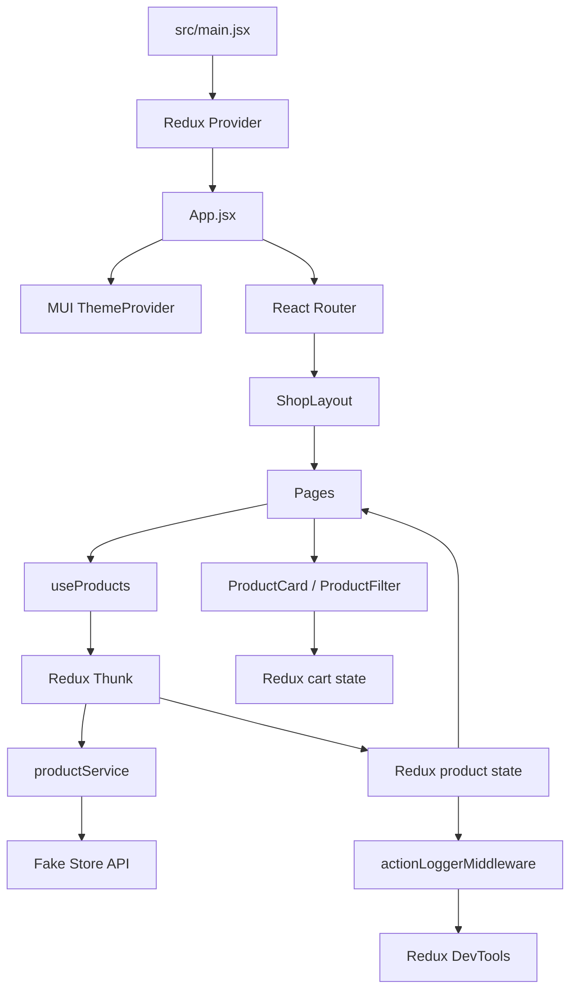

# Архітектура

Застосунок побудований навколо React, React Router, MUI та Redux Toolkit.

## Дані товарів

`useProducts` dispatch-ить `fetchProductList` для каталогу або `fetchProductDetails` для сторінки товару. Thunk викликає service, а slice обробляє `pending`, `fulfilled` і `rejected` стани.

## Глобальний стан

- `productList` — список товарів, loading та error.
- `productDetails` — поточний товар, loading та error.
- `cart` — товари кошика.

## UI-стан

Пошук, вибрана категорія, стан checkout-форми та режим MUI-теми залишаються локальними станами відповідних компонентів.
